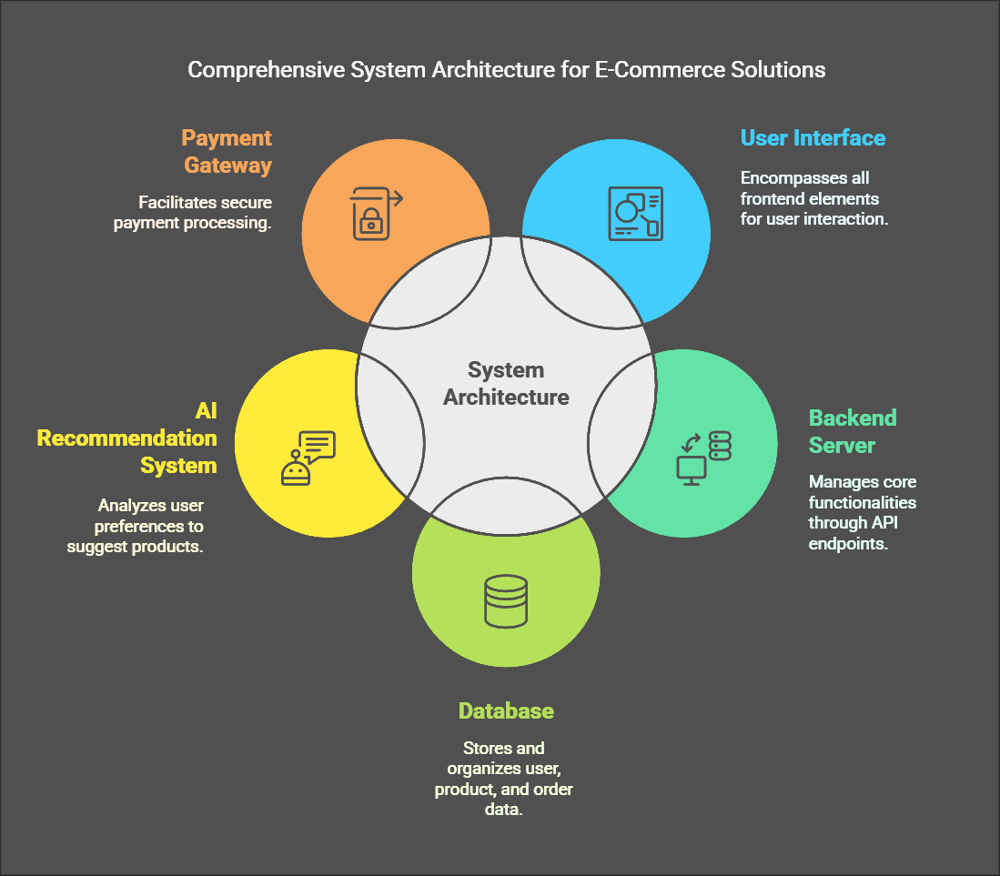

# E-Commerce Platform for Local Craftsmen: Vikreta

## Overview
Vikreta is an innovative e-commerce platform designed to empower local craftsmen by providing them with a digital marketplace to showcase and sell their unique, handcrafted products. This project aims to enhance the visibility of local artisans and facilitate a seamless shopping experience for users.

## Table of Contents
- [Features](#features)
- [Technologies Used](#technologies-used)
- [System Architecture](#system-architecture)
- [Installation](#installation)
- [Usage](#usage)
- [Contributors](#contributors)
- [License](#license)

## Features
- User-friendly interface for buyers and sellers
- Secure payment gateway integration
- Personalized product recommendations using AI
- Robust backend for data management
- Responsive design for accessibility across devices

## Technologies Used
- **Frontend:** Next.js, HTML, CSS, JavaScript
- **Backend:** Node.js
- **Database:** [Specify the database used, e.g., MongoDB, MySQL]
- **AI:** [Specify any AI frameworks or libraries used for recommendations]

## System Architecture
The system architecture is designed for efficiency, security, and seamless user interactions. It includes a robust database to manage data related to products, customers, sellers, and administrators.



## Installation
To set up the project locally, follow these steps:

1. Clone the repository:
   ```bash
   git clone https://github.com/yourusername/vikreta.git

1. Navigate to the project directory:
cd vikreta

2. Install the required dependencies:
npm install

3. Start the development server:
npm run dev

Usage

Once the server is running, you can access the application at http://localhost:3000. Explore the platform as a buyer or seller and experience the features offered.

Contributors

- Kuldeep Kumar Jha - Backend, Tech Stack Finalization

- Yashwardhan Rastogi - Payment Gateway, Backend Integration

- Sanskar Singh Chandel - Frontend Development

- Manjari Sharma - Backend Integration

- Pankaj Kumar - Frontend Development

- Jatin Aggarwal - Backend, Payment Gateway

- Rahul Nihalani - Product Recommendation Systems (AI)

- Shwetank Thakur - Product Recommendation Systems (AI)

- Amar Rathour - Frontend Development

License

This project is licensed under the MIT License - see the LICENSE file for details.

Feel free to customize the content, especially the installation instructions, usag